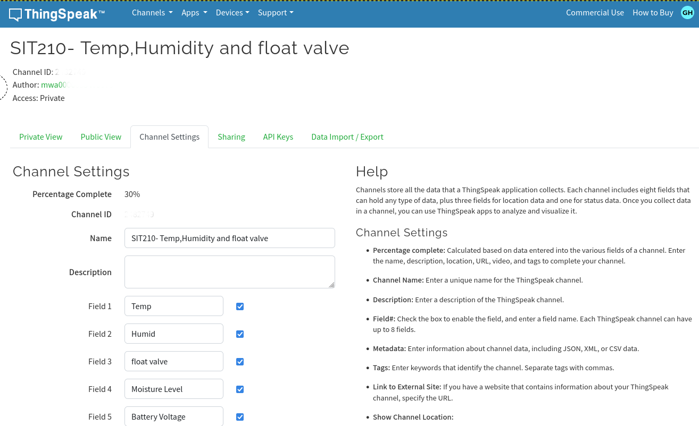
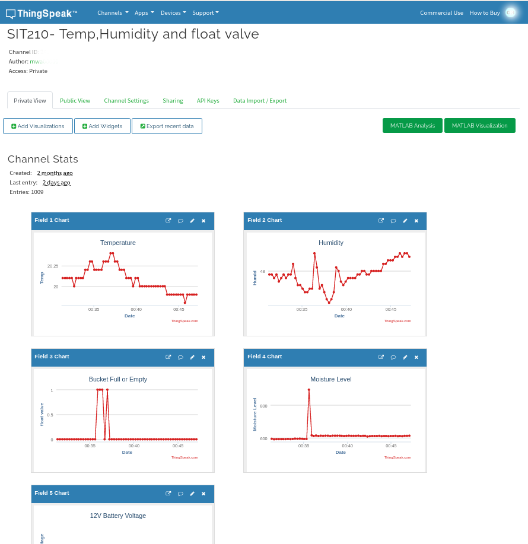
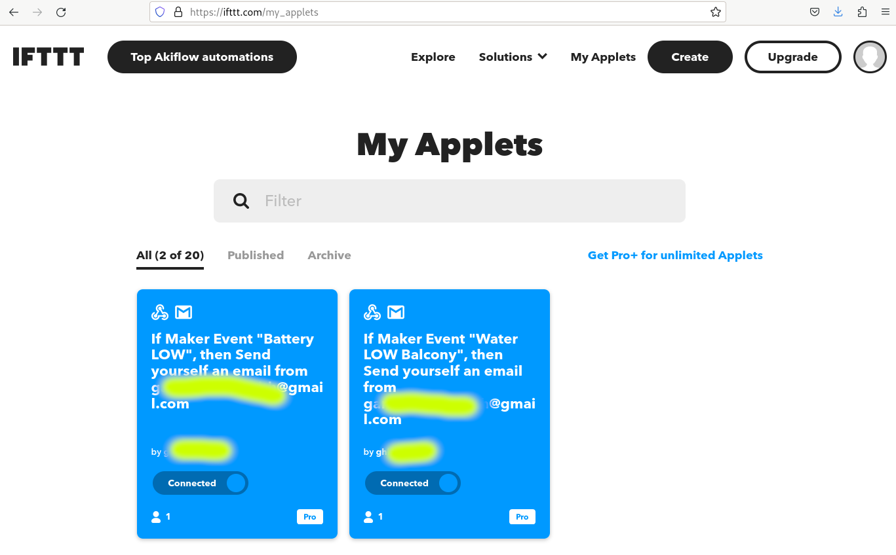

:Author: ghiltonsmith
:Email: {AuthorEmail}
:Date: 23/03/2024
:Revision: version#1
:License: Public Domain

= Project: Portable battery operated solar watering system

The project that I have chosen to  complete is an automated watering system that is portable battery operated and solar charging balcony watering system for people who want a beautiful tranquil balcony garden without having to spend hours on the balcony maintaining a garden.

This project should be suitable for the elderly, renters or people who travel and don’t want to sped each day looking after a balcony garden.
 
* This project has been built from Debian Lunix and all commands are for configuring this project from a Debian Linux host. *

image::Overview.png[Project Hardware Overview]

image::UML-DataFlowDiagram.png[UML Data Flow] 

= Set by Step Installation
 
== Step 1: Connecting Raspberry Pi up as Indoor Indicator

**Parts Required**
|===
| ID | Part name                      | Part number | Quantity
| 01 | 10k Resistor                   |             | 1
| 02 | Red LED                        |             | 1
| 03 | Raspberry PI 4B                |             | 1
| 04 | Prototype Breadboard           |             | 1
| 05 | Male-to-Female Jumper Cables   |             | 2
|===

Connect LED the Negative leg of your LED to 220Ohm resister 
connect 220Ohm resister to ground
connect LED Positive(anode) leg (longer leg) to GPIO Pin 21

from the CLI console of your RaspberryPi run the following commands

....
$ sudo apt-get update

$ sudo apt-get dist-upgrade

$ sudo apt-get install python3 git wget

$ python3 -m venv indicator

$ source indicator/bin/activate

$ pip install paho.mqtt

$ pip install RPi.GPIO

$ wget https://github.com/GarethLHS/SIT210/blob/main/Task11.1HD-Final_Project/final_project_watering_system/RaspberryPi/balcony_wateringMQTT.py

....

You will need to use your favorite editor nedit, pico, vim to edit your mqtt settings that you will subscribe to from thinkspeak.com

Follow the code below to run your Raspberry code
....
$ python3 ./balcony_wateringMQTT.py
....

image::Raspberry_PI4-connections.png[Raspberry PI 4B Hardware Connections]

== Step 2: Configuring Arduino MKR Wifi 1010 IoT board

**Parts Required**
|===
| ID | Part name                               | Part number | Quantity  | Store
| 07 | 12-24V Solar Panel                      | ZM9052      | 1         | Jaycar
| 08 | 12V SLA Lead Acid Battery 6Ah           | SB2486      | 1         | Jaycar
| 09 | 5V relay                                | XC441       | 1         | Jaycar
| 10 | Prototype Breadboard                    | PB8820      | 1         | Jaycar
| 11 | Pin-to-Pin Jumper Cables                | WC6024      | various   | Jaycar
| 11 | Pin-to-Socket Jumper Cables             | WC6028      | various   | Jaycar
| 11 | Socket-to-Socket Jumper Cables          | WC6026      | various   | Jaycar
| 12 | 15 Amp 12-way Screw Terminal Strip      | HM230       | 1         | Jaycar
| 13 | 7.5 Amp 2 Core Tinned DC Power Cable    | WH2057      | 1m        | Jaycar
| 14 | Float Switch                            | SF0920      | 1         | Jaycar
| 15 | DHT22 Temperature/Humidity sensor       | 018-DHT22   | 1         | Core-electronics
| 16 | BLA TMC Submersible Water Pump 24V      | 116270      | 1         | BCF
| 17 | Gravity:Analog Soil Moisture Sensor     | SEN308      | 1         | Core-electornics
| 18 | Solar Power Manager 12V Battery         | DFR0580     | 1         | Core-electornics
| 19 | Arduin MKR WiFi 1010 IoT Board          | ABX00023    | 1         | Core-electornics

|===

....
$ sudo apt-get update
$ sudo apt-get dist-upgrade

$sudo apt-get install git 

$ git clone https://github.com/GarethLHS/SIT210.git
$ cd Task11.1HD-Final_Project

....

*Download Arduino IDE from arduino.cc*
https://www.arduino.cc/en/software

Configure your Arduino for IoT cloud add your device onto IoT cloud. This will make configuring your Arduino and ensure you have updated SSL root certificates if required.

Once you are running the Arduino IDE you can open the final_project_watering_system.ino, arduino_secrets.h and thingsProperties.h files confiure for your network by changeing the SSID and credentials.

image::Arduino-connections.png[Arduino Hardware connections]

== Step 3: Configure ThinkSpeak WebHosting

Create an account on https://thingspeak.com
 

**ThinkSpeak database::

* field1=temp
* field2=humid
* field3=floatSwitchState
* field4=soilMoistureValue
* field5=voltage

*Configure MQTT hosting
Go to Devices --> MQTT --> Add new Devices --> Give it a name and select the channel you have already created --> then click Add Device

This will create your MQTT hosting you will need to copy the Client ID and credentials and put these details into your Arduino code.

== Step 4: Configure IFTTT Webhooks

You will need to configure 2 webhooks and edit they Arduino code to replace your webhook address.

== Step 5: Connect the Drip irrigation system

Connect your clear (21)Pope tubing to the water pump the other end connects to (23) Ladco hose fitting. 
This then clicks into (22) Ladco Click Poly Irrigation Tube fitting.

Now the 4mm tube gets connected to the (24) T joind then to the (25) Holman 4mm drip irrigation end that will be  spiked into your pot plant.

|===
| ID | Part name                               | Part number | Quantity  | Store
| 20 | Holman 4mm water irrigation pipe 10m    | 3120586     | 1         | Bunnings
| 21 | Pope 13mm clear vynal tubing 5m         | 3130568     | 1         | Bunnings
| 22 | Ladco 4mm Click Poly Irrigation Tube fit| 3110772     | 1         | Bunnings
| 23 | Ladco 13mm Click Poly Hose fitting      | 3110337     | 1         | Bunnings
| 24 | Pope 4mm Barbed Tee - 10 Pack           | 3120352     | 1         | Bunnings
| 25 | Holman 4mm Barbed Drip Iragation 5 Pack | 3120576     | 1         | Bunnings
|===

=== My Building Methodology

I built this project as modules and brought all the modules together to complete the project.

*Module 1: Raspberry Pi Indoor LED indicator*::

* Install PI OS on board
* Connect to Wifi
* Enable remote access via SSH
* Create venv virtual environment and activate
* Connect Raspberry PI to LED
* Program GPIO Python code to turn on and off LED (skeleton code).

*Module 2: Arduino WiFi 1010 MKR board*::

* add board to cloud.arduino.cc cloud environment
* configure Wifi
* connect Temperature/Hunidity sensor
* program sensor and test output to serial console
* connect moisture sensor
* program moisture sensor and output to serial console
* connect 5v relay
* program 5v relay to turn on and off and test
* connect float switch to board 
* program Arduino to receive digital signal from float switch

*Module 3: Battery Power solution*::

* connect solar panel to power management board
* connect battery to power management board
* connect water pump to battery and relay and test.
	
*Module 4: Think Speak Web integration*::

* setup ThinkSpeak account
* setup channel to receive data from Arduino
* Program Arduino to send data via GET requests to Think Speak
* configure ThinkSpeak to display data to webpage.

*Module 5: Think Speak MQTT broker setup*::

* configure MQTT broker on ThinkSpeak Web Page
* configure Raspberry Pi to subscribe to published topic

*Module 6: IFTTT Web alert system*::

* Setup IFTTT account
* purchase Pro account
* configure IFTTT to have permission to send Gmail email
* setup WebHook to trigger email for  Empty bucket
* setup WebHook to trigger email for Low Battery

*Module 7: Program IFTTT alerts on Arduino*::

* program webhooks get requests to trigger alerts
* write function ifttt Empty Bucket
* write function ifttt Low battery

*Module 8: Build physical hose system*::

* connect watering irrigation drip system
* test system with watering system connected.

*Module 9: Full system test with components*

*Module 10: Produce Live Demo and Recorded Video*
https://youtu.be/092AvqhdYYs

=== Video Demo

https://youtu.be/092AvqhdYYs

=== License
This project is released under a {License} License.

=== Contributing
To contribute to this project please contact ghiltonsmith https://id.arduino.cc/ghiltonsmith

=== BOM
Add the bill of the materials you need for this project.

|===
| ID | Part name                               | Part number | Quantity  | Store
| 01 | 10k Resistor                            |             | 1         |
| 02 | Red LED                                 |             | 1         |
| 03 | Raspberry PI 4B                         |             | 1         |
| 04 | Prototype Breadboard                    |             | 1         |
| 05 | Male-to-Female Jumper Cables            |             | 2         |
| 07 | 12-24V Solar Panel                      | ZM9052      | 1         | Jaycar
| 08 | 12V SLA Lead Acid Battery 6Ah           | SB2486      | 1         | Jaycar
| 09 | 5V relay                                | XC441       | 1         | Jaycar
| 10 | Prototype Breadboard                    | PB8820      | 1         | Jaycar
| 11 | Pin-to-Pin Jumper Cables                | WC6024      | various   | Jaycar
| 11 | Pin-to-Socket Jumper Cables             | WC6028      | various   | Jaycar
| 11 | Socket-to-Socket Jumper Cables          | WC6026      | various   | Jaycar
| 12 | 15 Amp 12-way Screw Terminal Strip      | HM230       | 1         | Jaycar
| 13 | 7.5 Amp 2 Core Tinned DC Power Cable    | WH2057      | 1m        | Jaycar
| 14 | Float Switch                            | SF0920      | 1         | Jaycar
| 15 | DHT22 Temperature/Humidity sensor       | 018-DHT22   | 1         | Core-electronics
| 16 | BLA TMC Submersible Water Pump 24V      | 116270      | 1         | BCF
| 17 | Gravity:Analog Soil Moisture Sensor     | SEN308      | 1         | Core-electornics
| 18 | Solar Power Manager 12V Battery         | DFR0580     | 1         | Core-electornics
| 19 | Arduin MKR WiFi 1010 IoT Board          | ABX00023    | 1         | Core-electornics
| 20 | Holman 4mm water irrigation pipe 10m    | 3120586     | 1         | Bunnings
| 21 | Pope 13mm clear vynal tubing 5m         | 3130568     | 1         | Bunnings
| 22 | Ladco 4mm Click Poly Irrigation Tube fit| 3110772     | 1         | Bunnings
| 23 | Ladco 13mm Click Poly Hose fitting      | 3110337     | 1         | Bunnings
| 24 | Pope 4mm Barbed Tee - 10 Pack           | 3120352     | 1         | Bunnings
| 25 | Holman 4mm Barbed Drip Iragation 5 Pack | 3120576     | 1         | Bunnings
|===

=== Help
This document is written in the _AsciiDoc_ format, a markup language to describe documents.
If you need help you can search the http://www.methods.co.nz/asciidoc[AsciiDoc homepage]
or consult the http://powerman.name/doc/asciidoc[AsciiDoc cheatsheet]
