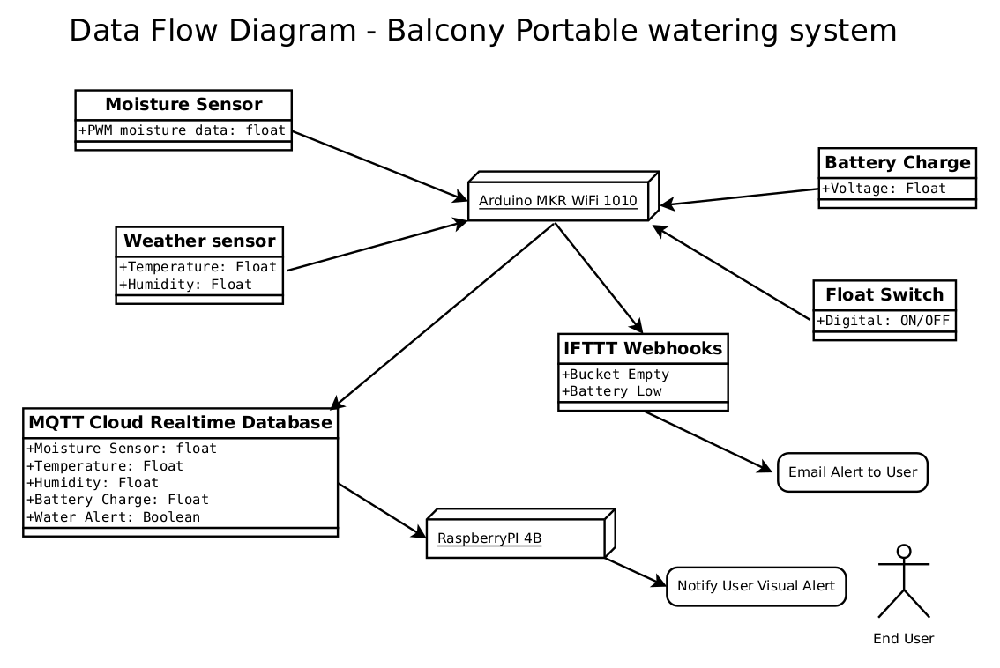
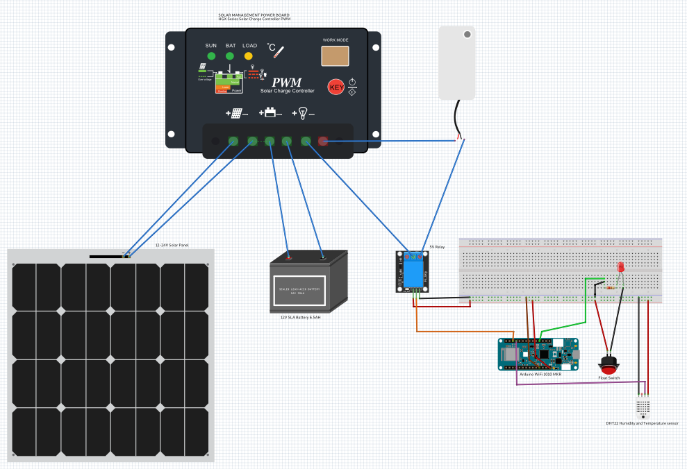

:Author: ghiltonsmith
:Email: {AuthorEmail}
:Date: 23/03/2024
:Revision: version#1
:License: Public Domain

= Project: Portable battery operated solar watering system

The project that I have chosen to  complete is an automated watering system that is portable battery operated and solar charging balcony watering system for people who want a beautiful tranquil balcony garden without having to spend hours on the balcony maintaining a garden.

This project should be suitable for the elderly, renters or people who travel and don’t want to sped each day looking after a balcony garden.
 

image::Overview.png[Project Hardware Overview]

 

= Set by Step Installation
 
== Step 1: Connecting Raspberry Pi up as Indoor Indicator
Connect LED the Negative leg of your LED to 220Ohm resister 
connect 220Ohm resister to ground
connect LED Positive(anode) leg (longer leg) to GPIO Pin 21

from the CLI console of your RaspberryPi run the following commands

....
$ sudo apt-get update

$ sudo apt-get dist-upgrade

$ sudo apt-get install python3 git wget

$ python3 -m venv indicator

$ source indicator/bin/activate

$ pip install paho.mqtt

$ pip install RPi.GPIO

$ wget https://github.com/GarethLHS/SIT210/blob/main/Task11.1HD-Final_Project/final_project_watering_system/RaspberryPi/balcony_wateringMQTT.py

....

You will need to use your favorite editor nedit, pico, vim to edit your mqtt settings that you will subscribe to from thinkspeak.com

image::Raspberry_PI4-connections.png[Raspberry PI 4B Hardware Connections]

== Step 2: Configuring Arduino MKR Wifi 1010 IoT board

=== My Building Methodology

I built this project as modules and brought all the modules together to complete the project.

*Module 1: Raspberry Pi Indoor LED indicator*::

* Install PI OS on board
* Connect to Wifi
* Enable remote access via SSH
* Create venv virtual environment and activate
* Connect Raspberry PI to LED
* Program GPIO Python code to turn on and off LED (skeleton code).

*Module 2: Arduino WiFi 1010 MKR board*::

* add board to cloud.arduino.cc cloud environment
* configure Wifi
* connect Temperature/Hunidity sensor
* program sensor and test output to serial console
* connect moisture sensor
* program moisture sensor and output to serial console
* connect 5v relay
* program 5v relay to turn on and off and test
* connect float switch to board 
* program Arduino to receive digital signal from float switch

*Module 3: Battery Power solution*::

* connect solar panel to power management board
* connect battery to power management board
* connect water pump to battery and relay and test.
	
*Module 4: Think Speak Web integration*::

* setup ThinkSpeak account
* setup channel to receive data from Arduino
* Program Arduino to send data via GET requests to Think Speak
* configure ThinkSpeak to display data to webpage.

*Module 5: Think Speak MQTT broker setup*::

* configure MQTT broker on ThinkSpeak Web Page
* configure Raspberry Pi to subscribe to published topic

*Module 6: IFTTT Web alert system*::

* Setup IFTTT account
* purchase Pro account
* configure IFTTT to have permission to send Gmail email
* setup WebHook to trigger email for  Empty bucket
* setup WebHook to trigger email for Low Battery

*Module 7: Program IFTTT alerts on Arduino*::

* program webhooks get requests to trigger alerts
* write function ifttt Empty Bucket
* write function ifttt Low battery

*Module 8: Build physical hose system*::

* connect watering irrigation drip system
* test system with watering system connected.

*Module 9: Full system test with components*

*Module 10: Produce Live Demo and Recorded Video*
https://youtu.be/092AvqhdYYs

== Step 2: Assemble the circuit

Assemble the circuit following the diagram layout.png attached to the sketch

== Step 3: Load the code

Upload the code contained in this sketch on to your board

=== Folder structure

....
 sketch123                => Arduino sketch folder
  ├── sketch123.ino       => main Arduino file
  ├── schematics.png      => (optional) an image of the required schematics
  ├── layout.png          => (optional) an image of the layout
  └── ReadMe.adoc         => this file
....

=== License
This project is released under a {License} License.

=== Contributing
To contribute to this project please contact ghiltonsmith https://id.arduino.cc/ghiltonsmith

=== BOM
Add the bill of the materials you need for this project.

|===
| ID | Part name      | Part number | Quantity
| R1 | 10k Resistor   | 1234-abcd   | 10
| L1 | Red LED        | 2345-asdf   | 5
| A1 | Arduino Zero   | ABX00066    | 1
|===

=== Help
This document is written in the _AsciiDoc_ format, a markup language to describe documents.
If you need help you can search the http://www.methods.co.nz/asciidoc[AsciiDoc homepage]
or consult the http://powerman.name/doc/asciidoc[AsciiDoc cheatsheet]
